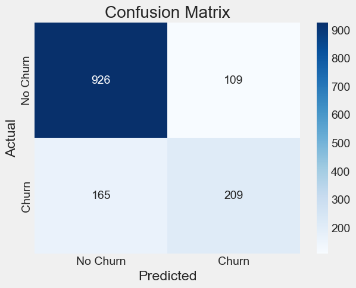

# Machine Learning for Customer Churn Prediction


A comprehensive machine learning project that predicts customer churn for a telecommunications company. This repository covers the end-to-end data science workflow, from exploratory data analysis to model training, evaluation, and interpretation.

---

### 📈 Business Problem & Project Goal

In the competitive telecom industry, customer retention is a key driver of profitability. Acquiring a new customer is significantly more expensive than retaining an existing one.

The goal of this project is to build a classification model that accurately predicts which customers are most likely to churn (cancel their service). The insights from this model can empower the business to:
*   **Proactively identify** at-risk customers.
*   **Target** them with specific retention campaigns (e.g., discounts, special offers).
*   **Understand** the key factors that drive churn, enabling data-driven improvements to products and services.

---

### ✨ Key Results & Model Performance

The final Logistic Regression model achieved an **accuracy of 80.6%** on the unseen test set. More importantly, it successfully identified **56% of the actual churners (Recall)**, providing the business with a focused list of at-risk customers to target.

#### Confusion Matrix


This matrix shows that the model correctly identified **209 churners** while also correctly identifying **926 loyal customers**.

---

### 📖 Table of Contents
* [Data Source](#-data-source)
* [Methodology](#-methodology)
* [Tech Stack & Libraries](#-tech-stack--libraries)
* [Getting Started](#-getting-started)
* [Project Structure](#-project-structure)
* [Key Insights from EDA](#-key-insights-from-eda)
* [Future Improvements](#-future-improvements)
* [Contact](#-contact)

---

### 💾 Data Source

The dataset used for this project is the "Telco Customer Churn" dataset from Kaggle. It contains customer account information, demographic data, and services they have signed up for.

*   **Source:** [Kaggle - Telco Customer Churn](https://www.kaggle.com/datasets/blastchar/telco-customer-churn)
*   **Size:** 7,043 customers (rows) × 21 features (columns).

---

### 🔬 Methodology

The project followed a structured machine learning workflow:

1.  **Exploratory Data Analysis (EDA):** Investigated the relationships between customer attributes and churn. Visualized key features to identify patterns and potential predictors.
2.  **Data Cleaning & Preprocessing:**
    *   Corrected data types (e.g., `TotalCharges` from object to numeric).
    *   Handled missing values using median imputation.
    *   Encoded the binary target variable `Churn` to 0s and 1s.
3.  **Feature Engineering & Pipeline:**
    *   Identified numerical and categorical features.
    *   Built a robust preprocessing pipeline using Scikit-learn's `ColumnTransformer` and `Pipeline`.
    *   **Numerical Features:** Scaled using `StandardScaler`.
    *   **Categorical Features:** Encoded using `OneHotEncoder`.
4.  **Model Training:**
    *   Split the data into training (80%) and testing (20%) sets, using stratification to maintain the churn ratio.
    *   Trained a `LogisticRegression` model, a strong baseline for binary classification.
5.  **Model Evaluation:**
    *   Assessed the model's performance on the test set using key classification metrics: Accuracy, Precision, Recall, and F1-Score.
    *   Visualized the results with a Confusion Matrix.

---

### 🛠️ Tech Stack & Libraries

*   **Language:** Python
*   **Core Libraries:**
    *   `Pandas`: For data manipulation and analysis.
    *   `NumPy`: For numerical operations.
    *   `Scikit-learn`: For the entire machine learning pipeline (preprocessing, modeling, evaluation).
*   **Visualization:**
    *   `Matplotlib` & `Seaborn`: For generating insightful plots and charts.
*   **Development Environment:**
    *   VS Code with Jupyter Notebook extension.

---

### 🚀 Getting Started

Follow these instructions to set up and run the project on your local machine.

#### **Prerequisites**
*   [Git](https://git-scm.com/)
*   [Python 3.9+](https://www.python.org/downloads/)

#### **Installation & Setup**

1.  **Clone the repository:**
    ```bash
    git clone https://github.com/[your-username]/customer-churn-prediction.git
    ```

2.  **Navigate to the project directory:**
    ```bash
    cd customer-churn-prediction
    ```

3.  **Create and activate a virtual environment:**
    *   **Windows:**
        ```bash
        python -m venv venv
        .\venv\Scripts\activate
        ```
    *   **macOS / Linux:**
        ```bash
        python3 -m venv venv
        source venv/bin/activate
        ```

4.  **Install the required dependencies:**
    ```bash
    pip install -r requirements.txt
    ```

#### **Usage**
The complete analysis and model development process is contained within the Jupyter Notebook.
*   Open and run the cells in `notebooks/01-Churn-Prediction-Model.ipynb` using VS Code or Jupyter Lab.

---

### 📁 Project Structure

```
customer-churn-prediction/
│
├── .gitignore
├── README.md
├── requirements.txt
│
├── data/
│   └── telco_churn.csv         # The raw dataset
│
├── img/
│   └── confusion_matrix.png
│   └── churn_by_contract.png   # Key visualizations
│
└── notebooks/
    └── 01-Churn-Prediction-Model.ipynb # End-to-end analysis and modeling
```

---

### 📊 Key Insights from EDA

The exploratory analysis revealed several strong indicators of churn:

*   **Contract Type:** Customers on a `Month-to-month` contract churn at a significantly higher rate than those on one or two-year contracts. This is the single strongest predictor.

*   **Customer Tenure:** New customers (low tenure) are far more likely to churn. Loyalty increases dramatically over time.
*   **Internet Service:** Customers with `Fiber optic` internet service have a higher churn rate compared to those with DSL, suggesting potential issues with price, quality, or competition in that service tier.

---

### 🌱 Future Improvements

*   **Advanced Models:** Experiment with more complex models like `RandomForestClassifier` or `GradientBoostingClassifier` (e.g., XGBoost, LightGBM) which can capture non-linear relationships and potentially improve recall.
*   **Feature Importance Analysis:** Extract and visualize feature importances (or model coefficients) to provide the business with a clear, ranked list of churn drivers.
*   **Hyperparameter Tuning:** Implement `GridSearchCV` or `RandomizedSearchCV` to find the optimal hyperparameters for the best-performing model.
*   **Handle Class Imbalance:** Utilize techniques like SMOTE (Synthetic Minority Over-sampling Technique) or adjust class weights in the model to specifically address the imbalanced nature of the churn data and potentially boost recall.
